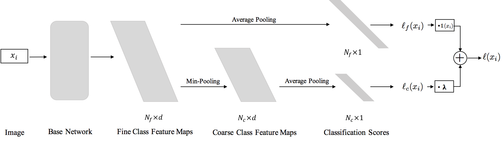

# classification_with_coarse_fine_labels
Code accompanying the paper [Weakly Supervised Image Classification with Coarse and Fine Labels](http://www.cs.umanitoba.ca/~ywang/papers/crv17.pdf). 

### Usage

- Download the proprecessed cifar100 dataset from https://yadi.sk/d/em4b0FMgrnqxy, put it into ```data``` subfolder in your project directory. Credit to @szagoruyko, see [here](https://github.com/szagoruyko/wide-residual-networks#dataset-support) for details.

- Run the experiment with cifar100 training dataset.

  `th 5_doall.lua`

### Model Architecture



### Citation

If you find this project useful for your work, please consider cite the paper.
```
@inproceedings{lei2017weakly,
  title={Weakly Supervised Image Classification with Coarse and Fine Labels},
  author={Lei, Jie and Guo, Zhenyu and Wang, Yang},
  booktitle={Computer and Robot Vision (CRV), 2017 14th Conference on},
  year={2017},
  organization={IEEE}
}
```


### Others

1. This code is initially based on @soumith's [code](https://github.com/soumith/imagenet-multiGPU.torch), but with heavy modifications.
2. For more information please refer to the [paper](http://www.cs.umanitoba.ca/~ywang/papers/crv17.pdf).
